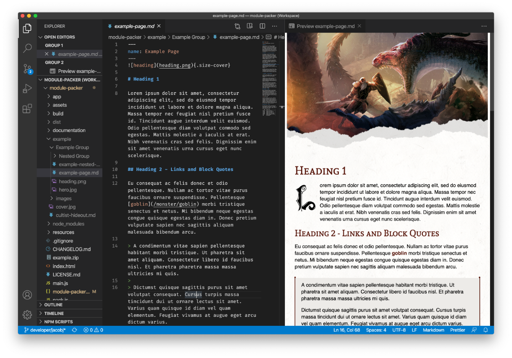

# EncounterPlus Markdown Extension



The EncounterPlus Markdown extension helps preview markdown as it would appear in the EncounterPlus application while you author the markdown. Simply install the extension, and the default markdown rendering engine will be changed to render as it would in EncounterPlus when using the [EncounterPlus Module-Packer](https://github.com/encounterplus/module-packer).

## Supported Markdown Extensions

### Images

A cover image can be made to extend to the edges of the page to match traditional RPG manual style by using the "size-cover" class.

Cover image example when NOT using pagebreaks:
```Markdown
{.size-cover}

# My Title
```

### Text blocks

You can add default text block with standard block quote syntax:

```Markdown
> Text block
```

Or `Read Aloud` text by adding custom class `read` to standard block quote:

```Markdown
> Read aloud text
{.read}
```

